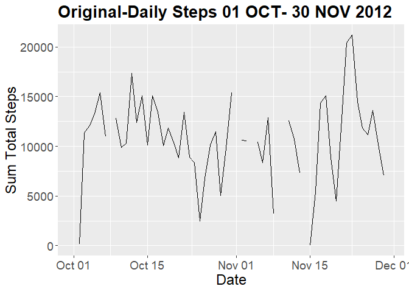

## Introduction

It is now possible to collect a large amount of data about personal
movement using activity monitoring devices such as a
[Fitbit](http://www.fitbit.com), [Nike
Fuelband](http://www.nike.com/us/en_us/c/nikeplus-fuelband), or
[Jawbone Up](https://jawbone.com/up). These type of devices are part of
the "quantified self" movement -- a group of enthusiasts who take
measurements about themselves regularly to improve their health, to
find patterns in their behavior, or because they are tech geeks. But
these data remain under-utilized both because the raw data are hard to
obtain and there is a lack of statistical methods and software for
processing and interpreting the data.

This assignment makes use of data from a personal activity monitoring
device. This device collects data at 5 minute intervals through out the
day. The data consists of two months of data from an anonymous
individual collected during the months of October and November, 2012
and include the number of steps taken in 5 minute intervals each day.

## Data

The data for this assignment can be downloaded from the course web
site:

* Dataset: [Activity monitoring data](https://d396qusza40orc.cloudfront.net/repdata%2Fdata%2Factivity.zip) [52K]

The variables included in this dataset are:

* **steps**: Number of steps taking in a 5-minute interval (missing
    values are coded as `NA`)

* **date**: The date on which the measurement was taken in YYYY-MM-DD
    format

* **interval**: Identifier for the 5-minute interval in which
    measurement was taken


The dataset is stored in a comma-separated-value (CSV) file and there
are a total of 17,568 observations in this
dataset.

## Load required packages

```r
#this loads the required packages for this entire markdown

# use this to read in the zip file in a single line
library(readr)

# use this for tidy syntax
library(tidyr)

#use this for piping
library(dplyr)

#use this for the plot
library(ggplot2)

#preferered method of dealing with dates and time
library(lubridate)
```

## Loading and preprocessing the data
This section performs the initial loads and preprocessing steps to summarize the data. Provides human labels regarding time(day and day type) information for context.  The summaries look at total steps and average total steps.  The aggregations are considered regardless of day, looking at day of week, and also looks at the day type (weekday or weekend). Not all were used, but were considered during the intial exploration of the data set.

```r
#use reader for the zip file and use of the R Studio IDE GUI

#load the data and specify the data types for the activity information and the formats YYYY-mm-dd and make both the interval and steps information integers
activity <- read_csv("activity.zip", col_types = cols(date = col_date(format = "%Y-%m-%d"), 
    interval = col_integer(), steps = col_integer()))

#finds the # of steps per day
daily_steps<-activity %>% group_by(date) %>% summarise(daily_steps=sum(steps))

#labels the day of the week
day_of_week<-wday(activity$date,label=TRUE)

#labels weekday or weekend
week_or_weekend<-ifelse(day_of_week %in% c("Sat", "Sun"), "Weekend", "Weekday")

#create a time of day
time_of_day<-(activity$date)+minutes(activity$interval)

#create a clock for reference
clock<-format(time_of_day, "%R")
  
daily_activity<-activity %>% 
  group_by(date) %>% 
  summarise(daily_steps=sum(steps)) %>% 
  mutate(day_of_week=wday(date,label=TRUE),week_or_weekend=ifelse(day_of_week %in% c("Sat", "Sun"), "Weekend", "Weekday"))

daily_activity2<-activity %>% 
  mutate(day_of_week=wday(date,label=TRUE),week_or_weekend=ifelse(day_of_week %in% c("Sat", "Sun"), "Weekend", "Weekday")) %>% 
  group_by(day_of_week,interval) %>% 
  summarise(daily_steps=sum(steps))

daily_clock<-activity %>% 
  mutate(day_of_week=wday(date,label=TRUE),week_or_weekend=ifelse(day_of_week     %in% c("Sat", "Sun"), "Weekend", "Weekday"),clock=clock) %>% 
  group_by(clock) %>% 
  summarise(daily_steps=sum(steps,na.rm=TRUE))

# the following are various aggregations a looks at the data using the sum and mean sum  daily interval1-3  look at this data using the sum and daily interval 4-6 utilize the mean, daily intervals 7-10 were formulated for the specific questions of the assignment

#interval only
daily_interval<-activity %>% 
  mutate(day_of_week=wday(date,label=TRUE),week_or_weekend=ifelse(day_of_week     %in% c("Sat", "Sun"), "Weekend", "Weekday")) %>% 
  group_by(interval) %>% 
  summarise(daily_steps=sum(steps,na.rm=TRUE))
#interval and day of week
daily_interval2<-activity %>% 
  mutate(day_of_week=wday(date,label=TRUE),week_or_weekend=ifelse(day_of_week     %in% c("Sat", "Sun"), "Weekend", "Weekday")) %>% 
  group_by(interval,day_of_week) %>% 
  summarise(daily_steps=sum(steps,na.rm=TRUE))
#interval, day of week, and week or weekend
daily_interval3<-activity %>% 
  mutate(day_of_week=wday(date,label=TRUE),week_or_weekend=ifelse(day_of_week     %in% c("Sat", "Sun"), "Weekend", "Weekday")) %>% 
  group_by(interval,day_of_week,week_or_weekend) %>% 
  summarise(daily_steps=sum(steps,na.rm=TRUE))
#interval
daily_interval4<-activity %>% 
  mutate(day_of_week=wday(date,label=TRUE),week_or_weekend=ifelse(day_of_week     %in% c("Sat", "Sun"), "Weekend", "Weekday")) %>% 
  group_by(interval) %>% 
  summarise(daily_steps=mean(steps,na.rm=TRUE))
#interval and day of week
daily_interval5<-activity %>% 
  mutate(day_of_week=wday(date,label=TRUE),week_or_weekend=ifelse(day_of_week     %in% c("Sat", "Sun"), "Weekend", "Weekday")) %>% 
  group_by(interval,day_of_week) %>% 
  summarise(daily_steps=mean(steps,na.rm=TRUE))
#interval and week or weekend
daily_interval6<-activity %>% 
  mutate(day_of_week=wday(date,label=TRUE),week_or_weekend=ifelse(day_of_week     %in% c("Sat", "Sun"), "Weekend", "Weekday")) %>% 
  group_by(interval,week_or_weekend) %>% 
  summarise(daily_steps=mean(steps,na.rm=TRUE))
#interval and week or weekend
daily_interval7<-activity %>% 
  mutate(day_of_week=wday(date,label=TRUE),week_or_weekend=ifelse(day_of_week     %in% c("Sat", "Sun"), "Weekend", "Weekday")) %>% 
  group_by(date,interval,day_of_week,week_or_weekend) %>% 
  summarise(daily_steps=mean(steps,na.rm=TRUE))
#interval and day of week
daily_interval8<-activity %>% 
  mutate(day_of_week=wday(date,label=TRUE),week_or_weekend=ifelse(day_of_week     %in% c("Sat", "Sun"), "Weekend", "Weekday")) %>% 
  group_by(interval,day_of_week) %>% 
  summarise(daily_steps=median(steps,na.rm=TRUE))
```

## What is mean total number of steps taken per day?

To find the average (mean) and median total number of steps recorded in the 2 month period we use the mean and median commands.  This calculation does not consider the missing NA values. The average daily total steps was~ **10,766** and median daily toal steps was **10,765**.  Note the recommended activity for most fitness wearables suggest a goal of 10,000 steps a day. This seems like a reasonable result.


```r
#find the average (mean)
avg_daily_steps<-mean(daily_steps$daily_steps,na.rm=TRUE)
avg_daily_steps
```

```
## [1] 10766.19
```


```r
#find the median (median)
median_daily_steps<-median(daily_steps$daily_steps, na.rm=TRUE)
median_daily_steps
```

```
## [1] 10765
```

## Create Histogram (Daily Total Steps)
We create a basic histogram of the frequency of a given daily total step sum for the 2-month period.  We note that in general most of the daily step totals are between 10-15,000.


```r
hist<-ggplot(data = daily_activity, aes(x =daily_steps)) + geom_histogram()+
  labs(title="Step Data 01 OCT- 30 NOV 2012", x=" Daily Total Steps", y="Frequency") +
  theme_light()
hist
```

<!-- -->

We designate the weekday (pink) and the weekend(green) for the same 2-month period.  We note that in general most of the daily step totals are still between 10-15,000.  Most weekends step totals are >10,000.


```r
#adds color based on the label of weekday or weekend as an overlay
hist2<-ggplot(data = daily_activity, aes(x = daily_steps, fill = week_or_weekend)) + geom_histogram()+
  labs(title="Step Data 01 OCT- 30 NOV 2012-Weekday vs Weekend", x="Total Steps", y="Frequency") +
  scale_fill_discrete(name = "Day Type", labels = c("Weekday", "Weekend"))+
  theme_light()+
  theme(legend.position = "bottom")
  
hist2
```

<!-- -->

When viewed side by side, we can also see this comparison of the weekday and weekend step totals for the 2-month period from 01 OCT 2012 - 30 NOV 2012.


```r
#same information presented using a facet wrap to show the weekday and weekend
hist4<-ggplot(data = daily_activity, aes(x = daily_steps)) + geom_histogram()+facet_wrap(~ week_or_weekend)
hist4
```

<!-- -->

## What is the average daily activity pattern?

To explore the average daily activity pattern for the 2-month period, a time series was developed to show the average number of steps regardless of the day for a specific 5-minute interval.  The resulting line plot shows the average total steps throughout the day midnight to midnight.  Note the relatively low activity between midnight and 0500 followed by increased activity until 1000.  The peak step activity was noted between the interval of 0830 and 0835 at **~206**  average steps in that interval or an average daily toal of **10,927** steps. Note a decline in activity after 2000, roughtly 8 PM in the United States.


```r
#create the line graph based on the 5 minute intervals
steps_daily_line <- ggplot(daily_interval4, aes(x=interval, y=daily_steps)) +
           geom_line(na.rm=TRUE) +  
           ggtitle("Daily Steps 01 OCT- 30 NOV 2012") +
           xlab("Time of Day-5 minute Intervals") + ylab("Avg Total Steps")+
           theme(plot.title = element_text(lineheight=.8, face="bold", 
                                          size = 20)) +
           theme(text = element_text(size=18))

steps_daily_line
```

<!-- -->


```r
# find the time period (5-min) with the highest step activity using max command
max(daily_interval4$daily_steps)
```

```
## [1] 206.1698
```

When considering the day of the week we find that the highest step activity is on Friday between 0845 and 0850 at **~329 steps**.  A graphical look at this also showed that Friday, Saturday, and Sunday tended to have more activity in the middle of the day.  The other days Mon-Thursday tended to have a bath tub shape.

```r
max(daily_interval5$daily_steps)
```

```
## [1] 328.5714
```


```r
steps_daily_line2 <- ggplot(daily_interval5, aes(x=daily_interval5$interval, y=daily_interval2$daily_steps)) +
           geom_line(na.rm=TRUE)+ facet_grid(daily_interval5$day_of_week)+
           ggtitle("Daily Steps 01 OCT- 30 NOV 2012") +
           xlab("Time of Day-5 minute Intervals") + ylab("Avg Total Steps")+
           theme(plot.title = element_text(lineheight=.8, face="bold", 
                                          size = 20)) +
           theme(text = element_text(size=18))

steps_daily_line2
```

<!-- -->

When considering the weekday versus weekend find that the highest step activity is on Friday between 0830 and 0835 at **~234 steps**.


```r
steps_daily_line3 <- ggplot(daily_interval6, aes(x=daily_interval6$interval, y=daily_interval6$daily_steps)) +
           geom_line(na.rm=TRUE)+facet_grid(as.factor(daily_interval6$week_or_weekend))+
           ggtitle("Daily Steps 01 OCT- 30 NOV 2012") +
           xlab("Time of Day-5 minute Intervals") + ylab("Avg Total Steps")+
           theme(plot.title = element_text(lineheight=.8, face="bold",
                                          size = 20)) +
           theme(text = element_text(size=18))

steps_daily_line3
```

<!-- -->

```r
max(daily_interval6$daily_steps)
```

```
## [1] 234.1026
```

## Imputing missing values

Note that there are a number of days/intervals where there are missing
values (coded as `NA`). The presence of missing days may introduce
bias into some calculations or summaries of the data.

Lets consider the impact of missing values.  Summing the total NA's there are **2,304** missing entries.  The data set has 17,568 observations.  This means there are roughly **13%** or between 8 days of missing step information.  When looking when these NA's occur there were 6 NAs on a Weekday (Mon-Fri) and 2 NAs on a Weekend.  There were 2 missing NAs on Mondays and Fridays. Tuesday was the only day that had no NAs.  Each other day of the Sun, Wed, Thurs, Sat each had one NA.  See NA analysis below.

```r
# to find the NA values first lets sum the number of NA.
Missing<-sum(is.na(activity$steps))
Missing
```

```
## [1] 2304
```


```r
#find percent missing
Percent_Missing<-Missing/length(activity$steps)
Percent_Missing
```

```
## [1] 0.1311475
```


```r
#show which days are missing by count

#filter for na (8)
id_missing<-daily_activity %>% filter(is.na(daily_activity$daily_steps))
#filter the remaining complete cases (53)
id_complete<-daily_activity %>%filter(!is.na(daily_activity$daily_steps))
#table to show which days of the week have NAs
day_missing<-table(id_missing$day_of_week)
#table to show weekday or weekend has NAs
type_missing<-table(id_missing$week_or_weekend)

day_missing
```

```
## 
## Sun Mon Tue Wed Thu Fri Sat 
##   1   2   0   1   1   2   1
```

```r
type_missing
```

```
## 
## Weekday Weekend 
##       6       2
```
## Lets devise a strategy for filling in all of the missing values in the dataset.

To account for estimates of the missing values it seems prudent to take into account the day of the week.  There tended to be higher activity on the weeked than the weekday.  We will calculate the daily median and mean as possible inputs to impute the missing values.  This portion will look at the daily activity.

```r
#find the median daily activity by day
median_by_day<-daily_activity %>% 
  group_by(day_of_week) %>% 
  summarise(daily_steps=median(daily_steps,na.rm=TRUE))

#find the mean daily activity by day
mean_by_day<-daily_activity %>% 
  group_by(day_of_week) %>% 
  summarise(daily_steps=mean(daily_steps,na.rm=TRUE))
```

This performs the requsite table joins to lookup of the imputed values for the new data set using the developed strategy.


```r
#specifies the column order
col_order <- c("date","daily_steps","day_of_week","week_or_weekend")

#creates the imputed data for the 8 NA values using the mean
impute_data_mean<-merge(x=id_missing,y=mean_by_day,by="day_of_week")
impute_data_mean$daily_steps.x<-impute_data_mean$daily_steps.y
impute_data_mean<-impute_data_mean[,-5]
names(impute_data_mean)[names(impute_data_mean)=="daily_steps.x"] <- "daily_steps"
impute_data_mean <- impute_data_mean[, col_order]

#creates the imputed data for the 8 NA values using the median
impute_data_median<-merge(x=id_missing,y=median_by_day,by="day_of_week")
impute_data_median$daily_steps.x<-impute_data_median$daily_steps.y
impute_data_median<-impute_data_median[,-5]
names(impute_data_median)[names(impute_data_median)=="daily_steps.x"] <- "daily_steps"
impute_data_median <- impute_data_median[, col_order]
```
This portion of the analysis combines the imputed data with the original complete cases.

```r
#row bind the imputed with the complete cases
imputed_mean<-rbind(id_complete,impute_data_mean)
imputed_median<-rbind(id_complete,impute_data_median)
```
## Updated Histogram (Daily Total Steps)

```r
#re use the histogram and mean and median sections above
#find the average (mean)
avg_daily_steps_imputed<-mean(imputed_mean$daily_steps,na.rm=TRUE)
avg_daily_steps_imputed
```

```
## [1] 10821.21
```

Here is the difference in the average daily step in the orignal data and using the mean (daily totals)`


```r
diff_mean<-avg_daily_steps_imputed-avg_daily_steps
diff_mean
```

```
## [1] 55.02092
```


```r
#find the median (median)
median_daily_steps_imputed<-median(imputed_median$daily_steps, na.rm=TRUE)
median_daily_steps_imputed
```

```
## [1] 11015
```

Here is the difference in the median daily step in the orignal data and using the median (daily totals)`


```r
diff_median<-median_daily_steps_imputed-median_daily_steps
diff_median
```

```
## [1] 250
```

This section of the analysis builds the necessary data for the updated histograms

```r
#tag each source
daily_activity$source<-"Original"
imputed_mean$source<-"Imputed Mean"
imputed_median$source<-"Imputed Median"

compare<-rbind(daily_activity,imputed_mean,imputed_median)
```

This uses the imputed daily mean


```r
#adds color based on the label of weekday or weekend as an overlay
hist6<-ggplot(data =imputed_mean, aes(x = daily_steps)) + geom_histogram()+
  labs(title="Step Data-Imputed Mean 01 OCT- 30 NOV 2012", x="Total Steps", y="Frequency") +
  theme_light()
  
hist6
```

<!-- -->

This uses the imputed daily median


```r
#adds color based on the label of weekday or weekend as an overlay
hist7<-ggplot(data =imputed_median, aes(x = daily_steps)) + geom_histogram()+
  labs(title="Step Data-Imputed Median 01 OCT- 30 NOV 2012", x="Total Steps", y="Frequency") +
  theme_light()
  
hist7
```

<!-- -->

Here we show a comparison of the histograms of the original data and the imputed values using the mean and the median.  Again the pink and green denotes weekday and weekend. Note using the imputed mean we had an average total step increase of **250** and a average total step increase of **55** when using the imputed median dataset.


```r
hist8<-ggplot(data =compare, aes(x = daily_steps, fill = week_or_weekend)) + geom_histogram()+
  labs(title="Step Data 01 OCT- 30 NOV 2012-Weekday vs Weekend", x="Total Steps", y="Frequency") + facet_grid(as.factor(compare$source))+
  scale_fill_discrete(name = "Day Type", labels = c("Weekday", "Weekend"))+
  theme_light()+
  theme(legend.position = "bottom")
  
hist8
```

<!-- -->

## Compare temporal view of the original and imputed data sets

In this section we show the impact to the daily step counts using a time series.  Similar to the histogram comparison above, we provide the original data set with missing values (NAs) and then show what the time series looks like when using the imputed mean and median respectively.  Finally we show the three time series on a single plot so that the reader can visually see the differences in the imputations for the information. 


```r
#create the line graph based on the step data
steps_daily_lines <- ggplot(daily_steps, aes(x=date, y=daily_steps)) +
           geom_line(na.rm=TRUE) +
           ggtitle("Original-Daily Steps 01 OCT- 30 NOV 2012") +
           xlab("Date") + ylab("Sum Total Steps")+
           theme(plot.title = element_text(lineheight=.8, face="bold",
                                          size = 20)) +
           theme(text = element_text(size=18))

steps_daily_lines
```

<!-- -->

```r
steps_daily_lines2 <- ggplot(imputed_mean, aes(x=date, y=daily_steps)) +
           geom_line(na.rm=TRUE) +
           ggtitle("Imputed Mean-Daily Steps 01 OCT- 30 NOV 2012") +
           xlab("Date") + ylab("Sum Total Steps")+
           theme(plot.title = element_text(lineheight=.8, face="bold",
                                          size = 20)) +
           theme(text = element_text(size=18))

steps_daily_lines2
```

<!-- -->

```r
steps_daily_lines3 <- ggplot(imputed_median, aes(x=date, y=daily_steps)) +
           geom_line(na.rm=TRUE) +
           ggtitle("Imputed Median-Daily Steps 01 OCT- 30 NOV 2012") +
           xlab("Date") + ylab("Sum Total Steps")+
           theme(plot.title = element_text(lineheight=.8, face="bold",
                                          size = 20)) +
           theme(text = element_text(size=18))

steps_daily_lines3
```

<!-- -->


```r
compare_steps_daily <- ggplot(compare, aes(x=date, y=daily_steps,color=source)) +
           geom_line(na.rm=TRUE) +
           ggtitle("Comparison-Daily Steps 01 OCT- 30 NOV 2012") +
           xlab("Date") + ylab("Sum Total Steps")+
           theme(plot.title = element_text(lineheight=.8, face="bold",
                                          size = 20)) +
           theme(text = element_text(size=18),legend.position = "bottom")

compare_steps_daily
```

<!-- -->

## Are there differences in activity patterns between weekdays and weekends?
By including the added detail for the weekend we still see increased activity (40-60 steps) for the mean and median daily step values.  This provides added awareness when comparing to our original excursion in looking at day of the week and type of day (weekday or weekend).  We noted previously increased activity on Fri-Sun, a later start to activity on the weekend, and a mountain versus bathtub shape to the weekend.

This section will considering the impacts of imputing the mean and median, but taking into the 5-min intervals associated with those days.  The goal is to get a more granualar view of the days and glean how the imputations impact the presented information.  The approach is a re-use of the method above, but instead of looking at the day of the week, we include the day of the week, and interval (time) to provide an estimate of the step information.

Similar to the histogram comparison above, we provide the original data set with missing values (NAs) and then show what the time series looks like when using the imputed mean and median respectively.  Finally we show the three time series on a single plot so that the reader can visually see the differences in the imputations for the information.  

First we develop the mean and median by day of week and interval(time)


```r
#develop the steps per interval
interval_mean<-daily_interval5
interval_median<-daily_interval8
```

Next we split the data set into two subsets.  Incomplete (NA's) and complete cases.

```r
#filter for nan created due to the NAs (2304)
id_missing2<-daily_interval7 %>% filter(daily_steps=="NaN")
#filter the remaining complete cases (15264)
id_complete2<-daily_interval7 %>%filter(daily_steps!="NaN")
```

Here we preform the associated joins, labeling, and sorting to build two new data sets using the imputed mean and median.


```r
#specifies the column order
col_order2 <- c("date","interval","daily_steps","day_of_week","week_or_weekend")

#creates the imputed data for the 2304 NA values using the mean
impute_data_mean2<-merge(x=id_missing2,y=interval_mean,by=c("day_of_week","interval"))
impute_data_mean2$daily_steps.x<-impute_data_mean2$daily_steps.y
impute_data_mean2<-impute_data_mean2[,-6]
names(impute_data_mean2)[names(impute_data_mean2)=="daily_steps.x"] <- "daily_steps"
impute_data_mean2 <- impute_data_mean2[, col_order2]

#creates the imputed data for the 2304 NA values using the median
impute_data_median2<-merge(x=id_missing2,y=interval_median,by=c("day_of_week","interval"))
impute_data_median2$daily_steps.x<-impute_data_median2$daily_steps.y
impute_data_median2<-impute_data_median2[,-6]
names(impute_data_median2)[names(impute_data_median2)=="daily_steps.x"] <- "daily_steps"
impute_data_median2 <- impute_data_median2[, col_order2]
```

Sort the two imputed data sets to match the order of the original data set


```r
#row bind the imputed with the complete cases for the mean and arrange by date
imputed_mean2<-rbind(id_complete2,impute_data_mean2)
imputed_mean2<-arrange(imputed_mean2, date,interval)
#row bind the imputed with the complete cases for the median and arrange by date
imputed_median2<-rbind(id_complete2,impute_data_median2)
imputed_median2<-arrange(imputed_median2, date,interval)
```

This builds a single data from for graphing each of the outputs a time series. The user defined tag identifies the source of the data set.


```r
#tag each source
daily_interval7$source<-"Original"
imputed_mean2$source<-"Imputed Mean"
imputed_median2$source<-"Imputed Median"

compare2<-rbind(daily_interval7,imputed_mean2,imputed_median2)
```

This step builds summary tables for plotting all, and each individual data set in the same consistent manner


```r
#interval and week or weekend for the three sources (original, mean, median)
daily_interval9<-compare2 %>% 
  group_by(interval,week_or_weekend,source) %>% 
  summarise(daily_steps=mean(daily_steps,na.rm=TRUE))


#interval and week or weekend for the mean
daily_interval10<-imputed_mean2 %>% 
  group_by(interval,week_or_weekend) %>% 
  summarise(daily_steps=mean(daily_steps,na.rm=TRUE))

#interval and week or weekend for the median
daily_interval11<-imputed_median2 %>% 
  group_by(interval,week_or_weekend) %>% 
  summarise(daily_steps=mean(daily_steps,na.rm=TRUE))
```

Here is the original data with missing values


```r
steps_daily_line3
```

<!-- -->

Here is the interval data using the imputed mean dataset.


```r
imputed_line_interval2 <- ggplot(daily_interval10, aes(x=daily_interval10$interval, y=daily_interval10$daily_steps)) +
           geom_line(na.rm=TRUE)+facet_grid(as.factor(daily_interval10$week_or_weekend))+
           ggtitle("Daily Steps-Imputed Mean 01 OCT- 30 NOV 2012") +
           xlab("Time of Day-5 minute Intervals") + ylab("Avg Total Steps")+
           theme(plot.title = element_text(lineheight=.8, face="bold",
                                          size = 20)) +
           theme(text = element_text(size=18))

imputed_line_interval2
```

<!-- -->

Here is the interval data using the imputed median dataset.


```r
imputed_line_interval3 <- ggplot(daily_interval11, aes(x=daily_interval11$interval, y=daily_interval11$daily_steps)) +
           geom_line(na.rm=TRUE)+facet_grid(as.factor(daily_interval11$week_or_weekend))+
           ggtitle("Daily Steps-Imputed Median- 01 OCT- 30 NOV 2012") +
           xlab("Time of Day-5 minute Intervals") + ylab("Avg Total Steps")+
           theme(plot.title = element_text(lineheight=.8, face="bold",
                                          size = 20)) +
           theme(text = element_text(size=18))

imputed_line_interval3
```

<!-- -->

Here is a comparison of the original versus the imputed mean and median datasets


```r
compare_line_interval2 <- ggplot(daily_interval9, aes(x=daily_interval9$interval, y=daily_interval9$daily_steps, color=daily_interval9$source)) +
           geom_line(na.rm=TRUE)+facet_grid(as.factor(daily_interval9$week_or_weekend))+
           ggtitle("Daily Steps 01 OCT- 30 NOV 2012") +
           xlab("Time of Day-5 minute Intervals") + ylab("Avg Total Steps")+
           theme(plot.title = element_text(lineheight=.8, face="bold",
                                          size = 20)) +
           theme(text = element_text(size=18),legend.position = "bottom")

compare_line_interval2
```

<!-- -->

Overall the imputed mean is more similar to the original data and the imputed median file most often had an estimate lower than the oringal data set.  It tended to bias low.
